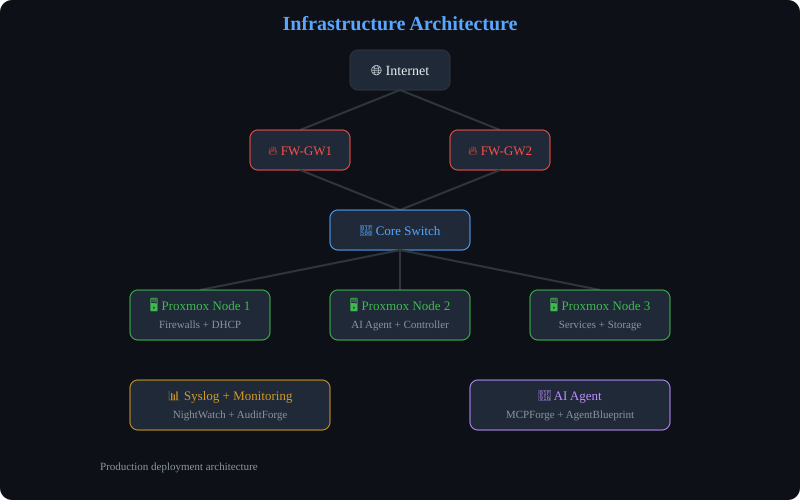

## English

Sysadmin & Network Engineer. I build and operate production infrastructure with AI-assisted automation.

### 🔧 Skills
Proxmox VE · UniFi · Sophos Firewall · VLAN · DHCP · Syslog · MCP · AI Agents · Terraform · Bash · Python

### 📌 All Projects

| # | Project | Description |
|---|---------|-------------|
| 1 | [ProxmOps](https://github.com/uMax-Cyber/ProxmOps) | Proxmox VM provisioning, cloud-init, disk resize |
| 2 | [NetPulse](https://github.com/uMax-Cyber/NetPulse) | Wi-Fi diagnostics: DHCP pool, roaming, RF analysis |
| 3 | [DHCPGuard](https://github.com/uMax-Cyber/DHCPGuard) | Sophos DHCP scope audit, silent denial detection |
| 4 | [PortLens](https://github.com/uMax-Cyber/PortLens) | UniFi switch port auditor, anomaly detection |
| 5 | [VLANscope](https://github.com/uMax-Cyber/VLANscope) | VLAN troubleshooting, native mismatch, DHCP relay |
| 6 | [NightWatch](https://github.com/uMax-Cyber/NightWatch) | Deterministic monitoring (no LLM), cron alerts |
| 7 | [AuditForge](https://github.com/uMax-Cyber/AuditForge) | Weekly automated security audit |
| 8 | [MCPForge](https://github.com/uMax-Cyber/MCPForge) | MCP architecture: routed-tools, safety tiers, 312 tools |
| 9 | [AgentBlueprint](https://github.com/uMax-Cyber/AgentBlueprint) | AI agent training: anti-hallucination, delegation |
| 10 | [AgentBench](https://github.com/uMax-Cyber/AgentBench) | 36-test automated grading for AI tools |
| 11 | [RAGOps](https://github.com/uMax-Cyber/RAGOps) | LightRAG production operations guide |
| 12 | [TerraForm-Lab](https://github.com/uMax-Cyber/TerraForm-Lab) | Terraform IaC for Proxmox VE |
| 13 | [OpsPlaybook](https://github.com/uMax-Cyber/OpsPlaybook) | Production runbooks with real incident lessons |
| 14 | [LogForge](https://github.com/uMax-Cyber/LogForge) | Multi-vendor syslog routing hub |
| 15 | [InsightReports](https://github.com/uMax-Cyber/InsightReports) | Animated SVG report template (dark theme) |
| 16 | [PolyVoice](https://github.com/uMax-Cyber/PolyVoice) | 3-language TTS + STT (ru/en/uz) |
| 17 | [AnsibleLab](https://github.com/uMax-Cyber/AnsibleLab) | Ansible automation playbooks |
| 18 | [AutoKit](https://github.com/uMax-Cyber/AutoKit) | Python automation scripts collection |
| 19 | [ArcherSec](https://github.com/uMax-Cyber/ArcherSec) | Security tools and research |
| 20 | [uMax-Cyber](https://github.com/uMax-Cyber/uMax-Cyber) | This profile README |

**🎯 Core Projects (1-16)** — production-grade infrastructure and AI tools
**📦 Legacy Projects (17-20)** — earlier automation and research work

### 🏗 Architecture

### 📬 Contact
📧 **[allumaxmail@gmail.com](mailto:allumaxmail@gmail.com)**

---

## Русский

Системный администратор и сетевой инженер. Проектирую и обслуживаю production-инфраструктуру с автоматизацией на базе ИИ.

### 🔧 Навыки
Proxmox VE · UniFi · Sophos Firewall · VLAN · DHCP · Syslog · MCP · ИИ-агенты · Terraform · Bash · Python

### 📌 Все проекты

| № | Проект | Описание |
|---|--------|----------|
| 1 | [ProxmOps](https://github.com/uMax-Cyber/ProxmOps) | Провижининг VM Proxmox, cloud-init, resize |
| 2 | [NetPulse](https://github.com/uMax-Cyber/NetPulse) | Диагностика Wi-Fi: DHCP-пул, роуминг, RF |
| 3 | [DHCPGuard](https://github.com/uMax-Cyber/DHCPGuard) | Sophos DHCP аудит, silent denial |
| 4 | [PortLens](https://github.com/uMax-Cyber/PortLens) | Аудитор портов UniFi, аномалии |
| 5 | [VLANscope](https://github.com/uMax-Cyber/VLANscope) | Диагностика VLAN, native mismatch |
| 6 | [NightWatch](https://github.com/uMax-Cyber/NightWatch) | Мониторинг без LLM, cron-алерты |
| 7 | [AuditForge](https://github.com/uMax-Cyber/AuditForge) | Еженедельный аудит безопасности |
| 8 | [MCPForge](https://github.com/uMax-Cyber/MCPForge) | MCP-архитектура: routed-tools, safety |
| 9 | [AgentBlueprint](https://github.com/uMax-Cyber/AgentBlueprint) | Обучение ИИ-агентов, анти-галлюцинация |
| 10 | [AgentBench](https://github.com/uMax-Cyber/AgentBench) | 36 тестов для ИИ-инструментов |
| 11 | [RAGOps](https://github.com/uMax-Cyber/RAGOps) | LightRAG production-эксплуатация |
| 12 | [TerraForm-Lab](https://github.com/uMax-Cyber/TerraForm-Lab) | Terraform IaC для Proxmox |
| 13 | [OpsPlaybook](https://github.com/uMax-Cyber/OpsPlaybook) | Production runbook'и |
| 14 | [LogForge](https://github.com/uMax-Cyber/LogForge) | Syslog-хаб multi-vendor |
| 15 | [InsightReports](https://github.com/uMax-Cyber/InsightReports) | Анимированные SVG-отчёты |
| 16 | [PolyVoice](https://github.com/uMax-Cyber/PolyVoice) | TTS + STT на 3 языках |
| 17 | [AnsibleLab](https://github.com/uMax-Cyber/AnsibleLab) | Ansible-плейбуки |
| 18 | [AutoKit](https://github.com/uMax-Cyber/AutoKit) | Python-скрипты автоматизации |
| 19 | [ArcherSec](https://github.com/uMax-Cyber/ArcherSec) | Инструменты безопасности |
| 20 | [uMax-Cyber](https://github.com/uMax-Cyber/uMax-Cyber) | Этот README-профиль |

**🎯 Основные проекты (1-16)** — production-инфраструктура и ИИ-инструменты
**📦 Ранние проекты (17-20)** — автоматизация и исследования

### 🏗 Архитектура

### 📬 Контакты
📧 **[allumaxmail@gmail.com](mailto:allumaxmail@gmail.com)**

---

## Oʻzbekcha

Tizim administratori va tarmoq muhandisi. Production infratuzilmani AI yordamida avtomatlashtirib yuritaman.

### 🔧 Koʻnikmalar
Proxmox VE · UniFi · Sophos Firewall · VLAN · DHCP · Syslog · MCP · AI agentlar · Terraform · Bash · Python

### 📌 Barcha loyihalar

| № | Loyiha | Tavsif |
|---|--------|--------|
| 1 | [ProxmOps](https://github.com/uMax-Cyber/ProxmOps) | Proxmox VM yaratish, cloud-init, disk |
| 2 | [NetPulse](https://github.com/uMax-Cyber/NetPulse) | Wi-Fi diagnostika: DHCP, roaming, RF |
| 3 | [DHCPGuard](https://github.com/uMax-Cyber/DHCPGuard) | Sophos DHCP auditi, jim rad etish |
| 4 | [PortLens](https://github.com/uMax-Cyber/PortLens) | UniFi port auditori, anomaliyalar |
| 5 | [VLANscope](https://github.com/uMax-Cyber/VLANscope) | VLAN muammolarini bartaraf etish |
| 6 | [NightWatch](https://github.com/uMax-Cyber/NightWatch) | LLMsiz monitoring, cron ogohlantirish |
| 7 | [AuditForge](https://github.com/uMax-Cyber/AuditForge) | Haftalik xavfsizlik auditi |
| 8 | [MCPForge](https://github.com/uMax-Cyber/MCPForge) | MCP arxitekturasi: safety, routing |
| 9 | [AgentBlueprint](https://github.com/uMax-Cyber/AgentBlueprint) | AI agent oʻqitish, anti-hallucination |
| 10 | [AgentBench](https://github.com/uMax-Cyber/AgentBench) | AI vositalar uchun 36 test |
| 11 | [RAGOps](https://github.com/uMax-Cyber/RAGOps) | LightRAG tizimini yuritish |
| 12 | [TerraForm-Lab](https://github.com/uMax-Cyber/TerraForm-Lab) | Proxmox uchun Terraform IaC |
| 13 | [OpsPlaybook](https://github.com/uMax-Cyber/OpsPlaybook) | Ishlab chiqarish qoʻllanmalari |
| 14 | [LogForge](https://github.com/uMax-Cyber/LogForge) | Koʻp manbali syslog markazi |
| 15 | [InsightReports](https://github.com/uMax-Cyber/InsightReports) | Animatsiyali SVG hisobotlar |
| 16 | [PolyVoice](https://github.com/uMax-Cyber/PolyVoice) | 3 tilda TTS + STT (ru/en/uz) |
| 17 | [AnsibleLab](https://github.com/uMax-Cyber/AnsibleLab) | Ansible avtomatizatsiya |
| 18 | [AutoKit](https://github.com/uMax-Cyber/AutoKit) | Python skriptlar toʻplami |
| 19 | [ArcherSec](https://github.com/uMax-Cyber/ArcherSec) | Xavfsizlik vositalari |
| 20 | [uMax-Cyber](https://github.com/uMax-Cyber/uMax-Cyber) | Bu profil README |

**🎯 Asosiy loyihalar (1-16)** — production infratuzilma va AI vositalar
**📦 Eski loyihalar (17-20)** — avvalgi avtomatizatsiya va tadqiqot ishlari

### 🏗 Arxitektura

### 📬 Aloqa
📧 **[allumaxmail@gmail.com](mailto:allumaxmail@gmail.com)**

---

